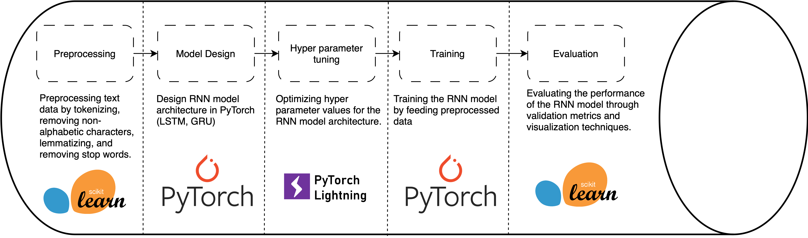

# Stack Overflow Topic Classifier

PyTorch-based RNN model for classifying Stack Overflow questions into Spark, Machine Learning, or Security categories.

## Table of Contents
- [Introduction](#introduction)
- [Installation](#installation)
- [Usage](#usage)
- [Contribution](#contribution)
- [License](#license)

## Introduction

The goal of this project is to develop an understanding of natural language processing and recurrent neural networks (RNNs) by implementing a topic classification model to categorize Stack Overflow questions into three categories: Spark, Machine Learning, or Security using PyTorch.

### Pipeline

### Dataset and Models

- Dataset: Stack Overflow data containing questions and their associated categories (Spark, Machine Learning, or Security)
- Models: RNN-based model (LSTM and GRU) as the primary approach

## Installation

_Coming soon._

## Usage

_Coming soon._

## Contribution

Contributions are welcome! Please feel free to submit a Pull Request or create an Issue to discuss new features or improvements.

## License

This project is licensed under the MIT License - see the [LICENSE](LICENSE) file for details.

