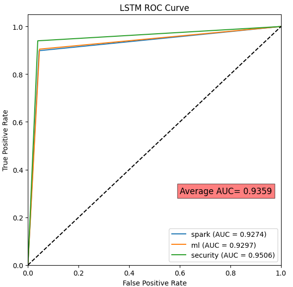
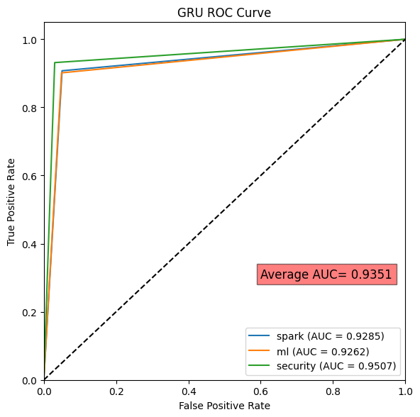
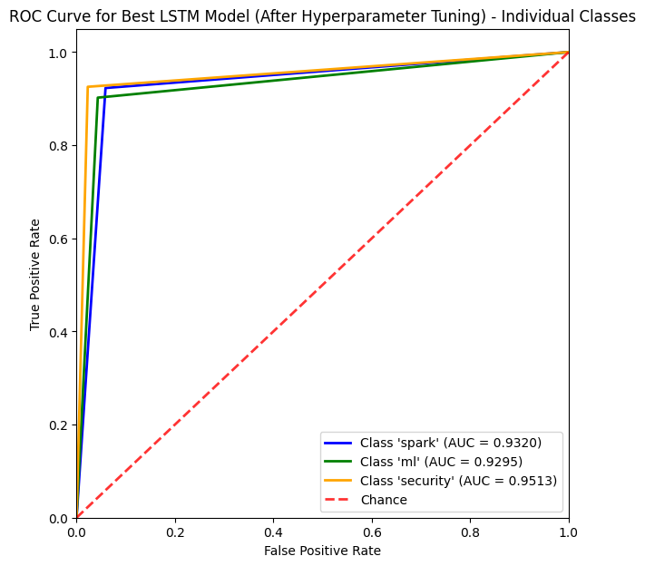
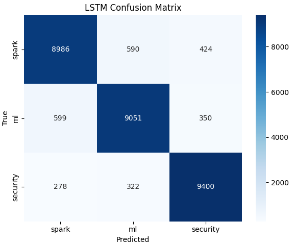
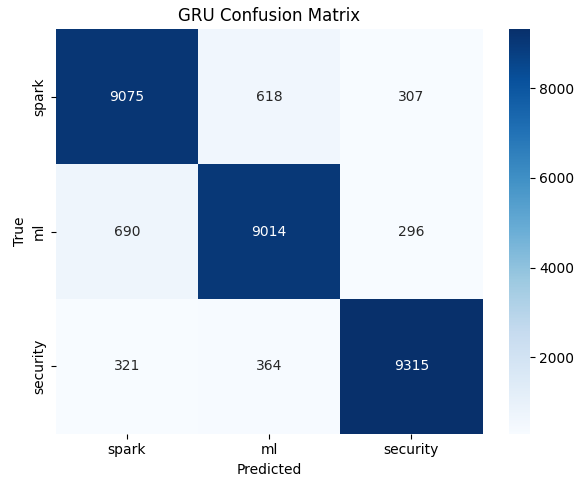
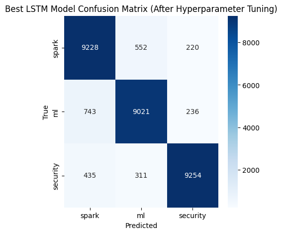

# Stack Overflow Topic Classifier

This project demonstrates the classification of Stack Overflow posts into three categories: "spark", "ml", and "security". The performance of two different recurrent neural network (RNN) architectures, Long Short-Term Memory (LSTM) and Gated Recurrent Unit (GRU), is compared.

## Table of Contents

- [Background](#background) 
- [Dataset](#dataset)
- [Getting Started](#usage)
- [Model Design](#model-design)
- [Training](#training)
- [Hyperparameter Tuning](#hyperparameter-tuning)
- [Results](#results)
- [Interpretation](#interpretation)
- [Reflection](#reflection)
- [License](#license)

## Background

This repository contains the following code files:
- [`SO-notebook.ipynb`](SO-notebook.ipynb): Jupyter Notebook that contains the code for training and evaluating a machine learning model on the Stack Overflow dataset.
- [`dataset/SO.csv`](dataset/SO.csv): Stack Overflow dataset used to train and evaluate the machine learning model in SO-notebook.ipynb.

## Dataset

The dataset used in this project is located in the [`dataset/SO.csv`](dataset/SO.csv) file. It contains Stack Overflow post titles and their corresponding labels ("spark", "ml", or "security").

The dataset consists of 150,000 entries with no missing values, and includes two columns: 'Title' and 'Label'. The data types for both columns are objects (strings).

The target distribution of the dataset is balanced, with each label having 50,000 samples:
- spark: 50,000
- ml: 50,000
- security: 50,000

## Getting Started

The entire project is implemented in a Jupyter Notebook. To run the project, follow these steps:

1. Clone the repository.
2. Open the Jupyter Notebook.
3. Run the notebook cells in order, starting from the top.

Ensure the required dependencies are installed.

## Model Design

Two RNN architectures are implemented and compared:

1. **LSTM Classifier**: An LSTM-based RNN model to classify Stack Overflow post titles.
2. **GRU Classifier**: A GRU-based RNN model to classify Stack Overflow post titles.

Both models are defined using the PyTorch framework, with custom classes `LSTMClassifier` and `GRUClassifier`.

## Training

The training process is implemented using a custom `train_and_evaluate()` function. The training loop consists of the following steps:

1. Set the model to training mode.
2. Iterate over the training data in mini-batches.
3. Perform forward pass.
4. Calculate the loss using CrossEntropyLoss.
5. Perform backpropagation to compute gradients.
6. Update model parameters using Adam optimizer.

## Hyperparameter Tuning

The hyperparameters of interest in this project are the hidden dimension and dropout rate. By experimenting with different values for these hyperparameters, we can improve model performance.

## Results

The performance of the two RNN models (LSTM and GRU) and the tuned LSTM model are compared using the following metrics:

### Receiver Operating Characteristic (ROC) curves

| LSTM Model | GRU Model | Tuned LSTM Model (ndim=128, dr=0.7) |
|------------|-----------|-----------------------------------------------|
|  |  |  |

### Confusion matrices

| LSTM Model | GRU Model | Tuned LSTM Model (ndim=128, dr=0.7) |
|------------|-----------|-----------------------------------------------|
|  |  |  |

### Classification reports

#### LSTM Model Performance:

| Metric     | Spark    | ML       | Security | Avg/Total |
|------------|----------|----------|----------|-----------|
| Precision  | 0.9111   | 0.9085   | 0.9239   | 0.9145    |
| Recall     | 0.8986   | 0.9051   | 0.9400   | 0.9146    |
| F1-score   | 0.9048   | 0.9068   | 0.9319   | 0.9145    |
| Support    | 10000    | 10000    | 10000    | 30000     |

#### GRU Model Performance:

| Metric     | Spark    | ML       | Security | Avg/Total |
|------------|----------|----------|----------|-----------|
| Precision  | 0.8998   | 0.9018   | 0.9392   | 0.9136    |
| Recall     | 0.9075   | 0.9014   | 0.9315   | 0.9135    |
| F1-score   | 0.9036   | 0.9016   | 0.9353   | 0.9135    |
| Support    | 10000    | 10000    | 10000    | 30000     |

#### Tuned LSTM Model Performance (ndim=128, dr=0.7):

| Metric     | Spark    | ML       | Security | Avg/Total |
|------------|----------|----------|----------|-----------|
| Precision  | 0.8868   | 0.9127   | 0.9530   | 0.9175    |
| Recall     | 0.9228   | 0.9021   | 0.9254   | 0.9168    |
| F1-score   | 0.9044   | 0.9074   | 0.9390   | 0.9169    |
| Support    | 10000    | 10000    | 10000    | 30000     |

These visualizations help in understanding and comparing the performance of the LSTM and GRU models, which aids in selecting the best model for the task.

## Interpretation
*i. As described in the proposal, was the question answered/topic investigated and how?*

The project aimed to deepen the understanding of natural language processing and recurrent neural networks by implementing a topic classification model for categorizing Stack Overflow questions into Spark, ML, or Security. This goal was successfully achieved through a systematic approach that involved the use of the PyTorch framework and RNN-based models, specifically LSTMs or GRUs, for handling sequential text data. High levels of accuracy, precision, recall, and F1-score across all categories demonstrated the effectiveness of the developed model. The positive outcomes highlight the proficiency of RNN-based models in processing sequential text data and capturing the inherent structure and dependencies in natural language.

A practical application of this model is to assist users in determining the appropriate category for posting their questions on Stack Overflow. By effectively categorizing questions, the model can enhance the user experience, guiding users to the correct category and facilitating quicker, more accurate responses from the community.

## Reflection
*i. Why did you select this problem to solve?*
I selected this problem to solve as it allowed me to learn and reinforce my understanding of NLP, and to apply it in different domains. I had previously used NLP in the context of Spark, but never with PyTorch. Additionally, I was interested in learning more about neural networks and the PyTorch framework, so this project provided a perfect opportunity for me to delve into these topics.

*ii. Were there any deviations from your proposal? Explain why (or why not).*
There were no significant deviations from the original project proposal. I followed a project guide based on Amazon reviews, which provided a solid foundation for building my project. This allowed me to focus on understanding and applying NLP and PyTorch concepts effectively throughout the project.

*iii. What did you find difficult about this project? What did you find easy? What did you learn?*
The most challenging aspect of this project was preprocessing the data, as it contained a lot of noise and required careful NLP text preprocessing. Converting between different data types such as strings, vectors, and tensors while ensuring the types are valid was particularly tricky.

On the other hand, I found designing the model and building the training loop relatively easy, since I could consult various sources for guidance, and the process of using PyTorch for machine learning appeared to be consistent across different cases. This allowed me to focus on the specific aspects of NLP and RNN-based models without getting bogged down in the details of the machine learning process itself.

Throughout this project, I learned a great deal about natural language processing, RNNs (specifically LSTMs and GRUs), and the PyTorch framework. The hands-on experience helped me gain a deeper understanding of the challenges and intricacies associated with NLP and text data. I also learned about the importance of data preprocessing and the various techniques that can be employed to clean and prepare text data for model training. Furthermore, I gained valuable experience in implementing and training neural network models using PyTorch and evaluating their performance.

Overall, this project has significantly increased my familiarity with PyTorch and deep learning, serving as an excellent stepping stone for further exploration of these topics. I thoroughly enjoyed applying the concepts learned in class to create my own machine learning models and look forward to building on this experience in future projects.

## License

This project is licensed under the [MIT License](LICENSE).

---

