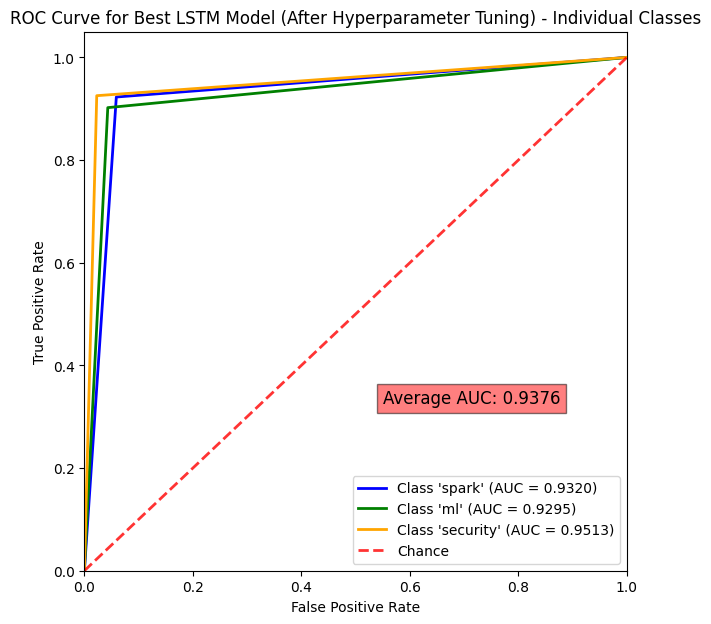
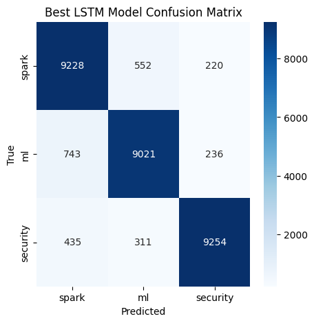

# Stack Overflow Topic Classifier

This project demonstrates the classification of Stack Overflow posts into three categories: "spark", "ml", and "security". The performance of two different recurrent neural network (RNN) architectures, Long Short-Term Memory (LSTM) and Gated Recurrent Unit (GRU), is compared.

## Table of Contents

- [Dataset](#dataset)
- [Model Design](#model-design)
- [Training](#training)
- [Hyperparameter Tuning](#hyperparameter-tuning)
- [Results](#results)
- [Usage](#usage)
- [License](#license)

## Dataset

The dataset used in this project is located in the `datasets/SO.csv` file. It contains Stack Overflow post titles and their corresponding labels ("spark", "ml", or "security").

The dataset consists of 150,000 entries with no missing values, and includes two columns: 'Title' and 'Label'. The data types for both columns are objects (strings).

The target distribution of the dataset is balanced, with each label having 50,000 samples:
- spark: 50,000
- ml: 50,000
- security: 50,000

## Model Design

Two RNN architectures are implemented and compared:

1. **LSTM Classifier**: An LSTM-based RNN model to classify Stack Overflow post titles.
2. **GRU Classifier**: A GRU-based RNN model to classify Stack Overflow post titles.

Both models are defined using the PyTorch framework, with custom classes `LSTMClassifier` and `GRUClassifier`.

## Training

The training process is implemented using a custom `train_and_evaluate()` function. The training loop consists of the following steps:

1. Set the model to training mode.
2. Iterate over the training data in mini-batches.
3. Perform forward pass.
4. Calculate the loss using CrossEntropyLoss.
5. Perform backpropagation to compute gradients.
6. Update model parameters using Adam optimizer.

## Hyperparameter Tuning

The hyperparameters of interest in this project are the hidden dimension and dropout rate. By experimenting with different values for these hyperparameters, we can improve model performance.

## Results

The performance of the two RNN models (LSTM and GRU) and the tuned LSTM model are compared using the following metrics:

### Receiver Operating Characteristic (ROC) curves

| LSTM Model | GRU Model | Tuned LSTM Model (ndim=128, dr=0.7) |
|------------|-----------|-----------------------------------------------|
|  |  |  |

### Confusion matrices

| LSTM Model | GRU Model | Tuned LSTM Model (ndim=128, dr=0.7) |
|------------|-----------|-----------------------------------------------|
|  |  |  |

### Classification reports

#### LSTM Model Performance:

| Metric     | Spark    | ML       | Security | Avg/Total |
|------------|----------|----------|----------|-----------|
| Precision  | 0.9111   | 0.9085   | 0.9239   | 0.9145    |
| Recall     | 0.8986   | 0.9051   | 0.9400   | 0.9146    |
| F1-score   | 0.9048   | 0.9068   | 0.9319   | 0.9145    |
| Support    | 10000    | 10000    | 10000    | 30000     |

#### GRU Model Performance:

| Metric     | Spark    | ML       | Security | Avg/Total |
|------------|----------|----------|----------|-----------|
| Precision  | 0.8998   | 0.9018   | 0.9392   | 0.9136    |
| Recall     | 0.9075   | 0.9014   | 0.9315   | 0.9135    |
| F1-score   | 0.9036   | 0.9016   | 0.9353   | 0.9135    |
| Support    | 10000    | 10000    | 10000    | 30000     |

#### Tuned LSTM Model Performance (ndim=128, dr=0.7):

| Metric     | Spark    | ML       | Security | Avg/Total |
|------------|----------|----------|----------|-----------|
| Precision  | 0.8868   | 0.9127   | 0.9530   | 0.9175    |
| Recall     | 0.9228   | 0.9021   | 0.9254   | 0.9168    |
| F1-score   | 0.9044   | 0.9074   | 0.9390   | 0.9169    |
| Support    | 10000    | 10000    | 10000    | 30000     |

These visualizations help in understanding and comparing the performance of the LSTM and GRU models, which aids in selecting the best model for the task.

## Usage

The entire project is implemented in a Jupyter Notebook. To run the project, follow these steps:

1. Clone the repository.
2. Open the Jupyter Notebook.
3. Run the notebook cells in order, starting from the top.

Ensure the required dependencies are installed.

## License

This project is licensed under the [MIT License](LICENSE).

---

